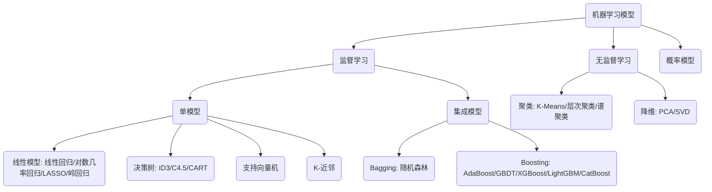

<!-- toc -->

## 1. 简介

本笔记旨在汇总机器学习（Machine Learning）的标准开发流程、核心算法模型分类、软硬件框架生态，以及主流大语言模型（LLM）的快速使用指引与常见问题排查。

---

## 2. 机器学习标准工作流

一个完整的机器学习项目通常遵循以下软件生命周期：

1. **需求分析**：
   - 确定 **任务类别**（如回归、分类、聚类、降维等）。
   - 设定 **性能指标**（如 Accuracy, ROC-AUC, F1-Score, RMSE 等）。
   - 确定 **数据模态**（结构化数据、半结构化数据，或图像、文本等非结构化数据）。
   - 调研市场同类竞品与前沿研究进展（SOTA）。
2. **数据采集**：
   - 获取内部私有业务数据、公开竞赛数据集（Kaggle, 天池等）或通过爬虫采集互联网公开数据。
3. **数据清洗**：
   - 处理脏数据、重复值、异常值以及不一致的编码问题。
4. **数据分析与可视化 (EDA)**：
   - 探索特征的基本统计信息、缺失值比例与数据样本分布特征。
5. **特征工程与建模调优**：
   - 特征提取、特征交互设计、缺失值填充。
   - 跨模型训练与超参数寻优（网格搜索、贝叶斯优化）。
6. **评估与解释**：
   - 分析最终性能指标，并从业务视角解释模型的特征重要性（如使用 SHAP 或 LIME 值）。
7. **模型部署与迭代**：
   - 封装为 API 或采用 Docker 容器化部署，建立线上监控与反馈数据收集链路。

---

## 3. 经典机器学习模型地图

### 3.1. A. 监督学习（单模型与集成）

- **线性模型**：线性回归、对数几率回归（逻辑回归）、LASSO 回归、岭（Ridge）回归、线性判别分析（LDA）。
- **非线性单模型**：$K$ 近邻（KNN）、决策树（ID3, C4.5, CART）、多层感知机（MLP）、支持向量机（SVM）。
- **集成学习 (Ensemble)**：
  - **Boosting（提升法）**：AdaBoost、GBDT、XGBoost、LightGBM、CatBoost。
  - **Bagging（袋装法）**：随机森林（Random Forest）。

### 3.2. B. 无监督学习

- **聚类**：$K$ 均值（K-Means）、层次聚类、谱聚类。
- **降维**：主成分分析（PCA）、奇异值分解（SVD）。

### 3.3. C. 概率模型与时序

- 最大熵模型、朴素贝叶斯、EM 算法。
- **概率图模型**：隐马尔可夫模型（HMM）、条件随机场（CRF）。
- 马尔可夫链蒙特卡洛方法（MCMC）。

---

## 4. GPU 硬件与计算平台选型

深度学习与大模型微调极度依赖 GPU 算力。以下是主流消费级与服务器显卡命名及选型规则：

### 4.1. NVIDIA 显卡 (N 卡)

N 卡依靠强大的 CUDA 生态，是深度学习开发的首选。

- **RTX 系列**：支持硬件级光线追踪（Ray Tracing），适用于中高端深度学习训练与推理（例如 RTX 3060, RTX 3090, RTX 4090）。
- **GTX / GT 系列**：中低端与入门系列，不支持光追（例如 GTX 1660 Ti）。
- **后缀辨析**：
  - **Ti**：加强版本（如 RTX 3080 Ti 性能强于 RTX 3080）。
  - **Super**：超級小幅升级版本，介于普通版与 Ti 之间。

### 4.2. AMD 显卡 (A 卡)

主要面向消费级游戏，在深度学习生态（基于 ROCm）上略逊于 NVIDIA。

- A 卡目前型号通常以 **RX** 开头（如 RX 7900 XTX），数字越大性能越强。
- **XT / XTX 后缀**：代表加强或旗舰版本。

---

## 5. 主流大模型工具与接入排坑

### 5.1. ChatGPT (OpenAI)

- **地址**：[ChatGPT Portal](https://chat.openai.com/)
- **使用限制与对策**：
  - **限制 1**：限制特定区域 IP 访问。
    - *对策*：利用 Cloudflare WARP 代理优化以绕过严格的 IP 检测。
  - **限制 2**：高并发时常报 `Too many requests in 1 hour`（过去一小时请求过多）。
    - *对策*：通常为当前代理节点出口负载过高，需切换负载较低的代理节点。

### 5.2. 星火运营与智文平台 (科大讯飞)

- **地址**：[星火运营](https://turbodesk.xfyun.cn/home) | [智文平台](https://zhiwen.xfyun.cn/home)
- **定位**：专注于长文档智能生成与大纲细化辅助，支持自动导出 Word 和 PPT。

### 5.3. Copilot (Microsoft)

- **地址**：[Microsoft Copilot](https://copilot.microsoft.com/)
- **使用限制与对策**：
  - 访问必须使用 Edge 浏览器或特定客户端。
  - 若提示超出限制，需重新登录关联的 Google 账号或 Microsoft 个人账户（建议使用美区账户）。

---

## 6. 核心资源导航

- **经典开发库**：
  - [scikit-learn 官方网站](https://scikit-learn.org/stable/) (经典机器学习)
  - [OpenCV GitHub 仓库](https://github.com/opencv/opencv) (计算机视觉基础)
  - [NLTK 官方网站](https://www.nltk.org/) (自然语言处理基础)
- **在线计算平台**：Google Colab、Kaggle Kernels。
- **学习教程**：
  - 《动手学深度学习》: [D2L Book](https://zh.d2l.ai/)
  - [Coursera 吴恩达机器学习课程](https://www.coursera.org/learn/machine-learning)
  - [Bilibili 李宏毅教授机器学习教程](https://www.bilibili.com/video/BV1Wv411h7kN/)
- **硬件开发参考**：
  - [NVIDIA CUDA Toolkit 官方下载](https://developer.nvidia.com/cuda-toolkit)
  - [快科技 GPU 天梯榜](https://www.mydrivers.com/zhuanti/tianti/gpu/index.html)
